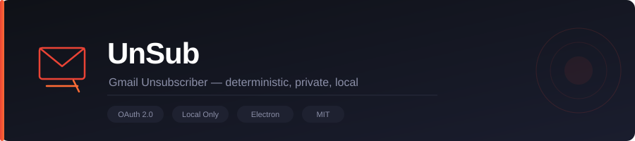
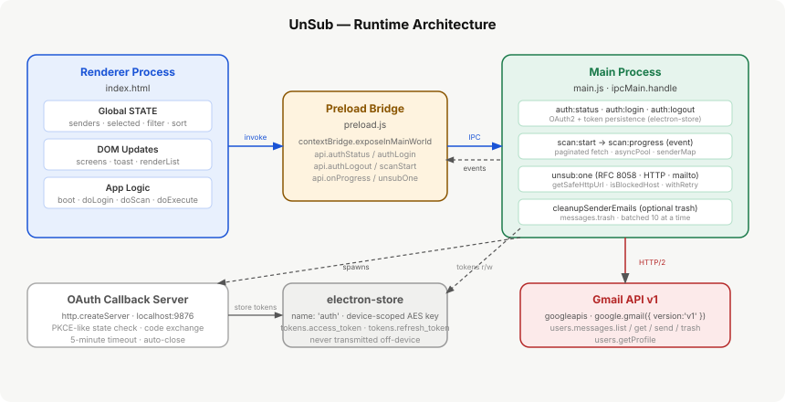

# UnSub

<div align="center">
  
</div>

> A local-only, privacy-first Electron desktop app that scans your Gmail inbox and executes unsubscribe actions — without sending your data to any third party.

---

## Table of Contents

1. [Project Overview](#project-overview)
2. [Architecture](#architecture)
3. [Components and Modules](#components-and-modules)
4. [Data Flow](#data-flow)
5. [Setup](#setup)
6. [Environment Variables](#environment-variables)
7. [Build](#build)
8. [Security Design](#security-design)
9. [License](#license)

---

## Project Overview

**UnSub** is a cross-platform desktop application built with [Electron](https://www.electronjs.org/). It connects to your Gmail account via OAuth 2.0, scans your inbox for subscription-type emails using RFC `List-Unsubscribe` header analysis and keyword matching, groups detected emails by sender, and executes unsubscribe actions through a prioritised fallback chain.

All processing runs on the user's local machine. No email content, tokens, or metadata are transmitted to any server other than Google's Gmail API.

**Entry point:** `gmail-unsub-electron/src/main.js` → `app.whenReady().then(createWindow)`  
**Renderer loaded:** `gmail-unsub-electron/src/index.html` (inline app logic + `app.js`)  
**Secure bridge:** `gmail-unsub-electron/src/preload.js` (`contextBridge.exposeInMainWorld`)

---

## Architecture



The application follows the standard Electron two-process model:

| Layer | Files | Role |
|---|---|---|
| Main Process | `src/main.js` | OAuth, Gmail API calls, IPC handlers |
| Preload Bridge | `src/preload.js` | Safe IPC surface exposed to renderer |
| Renderer Process | `src/index.html`, `src/app.js` | All UI, state management, user flows |
| Token Store | `electron-store` (encrypted) | Persists OAuth tokens on-device |
| OAuth Callback | `http.createServer` in `main.js` | Temporary localhost:9876 server for code exchange |

**Verified in:** `main.js:193–217` (window creation), `main.js:3–10` (imports), `preload.js:4–21` (bridge definition)

---

## Components and Modules

### Module: `gmail-unsub-electron/src/main.js`

**Purpose:** Electron main process. Owns all privileged operations: OAuth 2.0 flow, Gmail API calls, IPC handler registration, and the app window lifecycle.

**Key functions and their line ranges:**

| Function / Constant | Lines | Description |
|---|---|---|
| `GOOGLE_CLIENT_ID`, `GOOGLE_CLIENT_SECRET` | 25–26 | Read from `process.env`; never hardcoded |
| `REDIRECT_PORT = 9876`, `REDIRECT_URI` | 27–28 | Local OAuth callback endpoint |
| `SCOPES` | 29–33 | `gmail.readonly`, `gmail.modify`, `userinfo.email` |
| `REQUEST_TIMEOUT`, `AUTH_TIMEOUT` | 35–36 | 15 s per HTTP request; 5 min OAuth window |
| `SCAN_MESSAGE_CONCURRENCY = 12` | 39 | Max parallel Gmail API `messages.get` calls |
| `logError(context, err)` | 43–45 | Structured error log to stderr |
| `perfLog(event, data)` | 47–55 | Perf events; only active with `--dev` flag |
| `getScanConcurrency(scanLimit)` | 57–62 | Scales concurrency: 12 / 10 / 8 based on depth |
| `withRetry(fn, context, retries)` | 75–89 | Exponential back-off on 429/5xx/network errors |
| `asyncPool(items, maxConcurrent, taskFn)` | 91–102 | Concurrency-capped Promise pool |
| `isBlockedHost(hostname)` | 104–126 | Rejects loopback, private, link-local IPs |
| `getSafeHttpUrl(rawUrl)` | 128–137 | Validates scheme (`http`/`https`) + host safety |
| `isOAuthConfigured()` | 139–141 | Guards all auth calls |
| `escapeHtml(text)` | 143–153 | HTML-escapes OAuth callback page output; max 500 chars |
| `getEncryptionKey()` | 156–162 | SHA-256 of `app.getPath('userData')` → 32-char key |
| `store` | 165 | `new Store({ name:'auth', encryptionKey })` |
| `makeOAuthClient()` | 168–185 | Builds `google.auth.OAuth2`; loads persisted tokens |
| `createWindow()` | 193–217 | `BrowserWindow` with `contextIsolation:true`, `nodeIntegration:false` |
| `ipcMain.handle('auth:status')` | 225–242 | Checks token validity via `gmail.users.getProfile` |
| `ipcMain.handle('auth:login')` | 244–351 | Spawns localhost:9876 HTTP server; opens browser OAuth URL; exchanges code for tokens |
| `ipcMain.handle('auth:logout')` | 353–362 | Deletes tokens from `electron-store` |
| `SUBSCRIPTION_KEYWORDS` | 366–370 | 15 subject-line keywords used for subscription detection |
| `IMPORTANT_PATTERNS` | 372–377 | 14 regex patterns flagging financial/security senders as `risk:'important'` |
| `CATEGORY_MAP` | 379–390 | 10 regex rules mapping sender name/email to display category |
| `detectCategory(name, email)` | 392–396 | Applies `CATEGORY_MAP`; default `'Other'` |
| `detectImportance(name, email, subject)` | 398–401 | Returns `true` if any `IMPORTANT_PATTERNS` match |
| `extractUnsubFromHeaders(headers)` | 403–413 | Parses `List-Unsubscribe` header; extracts `httpUrl` + `mailto` |
| `getBodyHtml(payload)` | 415–421 | Recursively finds `text/html` part; base64url-decodes |
| `extractUnsubFromBody(html)` | 423–434 | Regex search for `unsubscribe`/`opt-out`/`manage.*pref` href |
| `sendProgress(phase, progress, meta)` | 436–440 | Sends `scan:progress` IPC event to renderer |
| `ipcMain.handle('scan:start')` | 442–591 | Full scan: paginated list → `asyncPool` metadata fetch → senderMap → result |
| `cleanupSenderEmails(gmail, messageIds)` | 601–623 | Batch-trashes scanned emails (10 at a time) when `cleanupInbox:true` |
| `ipcMain.handle('unsub:one')` | 625–796 | Priority unsubscribe: (1) RFC 8058 POST, (2) HTTP GET, (3) body link, (4) mailto |

---

### Module: `gmail-unsub-electron/src/preload.js`

**Purpose:** Secure IPC bridge. Exposes a minimal `window.api` surface to the renderer using Electron's `contextBridge`, preventing direct Node.js/IPC access from web context.

**Exposed API surface** (`preload.js:5–21`):

| Method | IPC channel | Direction |
|---|---|---|
| `api.authStatus()` | `auth:status` | invoke → main |
| `api.authLogin()` | `auth:login` | invoke → main |
| `api.authLogout()` | `auth:logout` | invoke → main |
| `api.scanStart(options)` | `scan:start` | invoke → main |
| `api.onProgress(cb)` | `scan:progress` | event ← main (returns unsubscribe fn) |
| `api.unsubOne(payload)` | `unsub:one` | invoke → main |

---

### Module: `gmail-unsub-electron/src/app.js`

**Purpose:** Renderer-side application logic providing two classes — `AppState` (data model) and `UIController` (DOM manipulation) — intended as a modular refactor. **Note:** `app.js` is not loaded by the production `src/index.html` (which uses its own self-contained inline script). It is a standalone module associated with `src/index-refactored.html`.

**Class: `AppState`** (`app.js:10–81`)

| Method | Description |
|---|---|
| `constructor()` | Initialises `senders[]`, `selected` (Set), `confirmed[]`, `filter`, `sort`, `currentScreen` |
| `reset()` | Clears all scan state |
| `addSenders(data)` | Replaces sender list and clears selection |
| `toggleSender(id)` | Toggles selection; no-op for `risk:'important'` senders |
| `isSenderLocked(id)` | Returns `true` if sender `risk === 'important'` |
| `getFilteredSenders()` | Applies `filter` ('safe'/'high'/all) and `sort` ('count'/'date') |
| `getSafeSenders()` | Returns senders with `risk:'safe'` AND `hasUnsub:true` |
| `getSelectedCount()` | Returns `selected.size` |
| `getSelectedEmails()` | Sums `count` across all selected senders |
| `setConfirmed()` | Copies selected senders into `confirmed[]` |

**Class: `UIController`** (`app.js:87–326`)

| Method | Description |
|---|---|
| `showScreen(name)` | Removes `active` from all `.screen` elements; adds it to `${name}-screen` |
| `setLoadingButton(buttonId, loading)` | Disables/enables button; sets `data-loading` attribute |
| `toast(message, duration, type)` | Shows `#toast` element; auto-hides after `duration` ms |
| `updateAuthUI(email)` | Shows/hides `#user-pill` with the authenticated email |
| `updateScanProgress(phase, progress)` | Updates `#prog-fill` width and `#prog-lbl` text |
| `renderSenderList()` | Populates `#sender-list` with `createSenderRow` output |
| `createSenderRow(sender)` | Returns HTML string for one sender row (initials, category badge, count) |
| `updateHeaderStats()` | Updates sender count, email total, safe count, smart-select label |
| `updateSelectionUI()` | Syncs `#chk-all` indeterminate state, `#sel-count`, bottom bar visibility |
| `updateConfirmScreen()` | Populates confirm screen with sender count, email count, preview list |
| `updateExecuteScreen(ok, fail)` | Updates execute summary card with success/failure counts |
| `setExecuteRowStatus(senderId, status, method)` | Updates individual row dot and label in execute screen |
| `escapeId(str)` | `CSS.escape(str)` for safe DOM ID queries |
| `escapeAttr(str)` | Escapes `&`, `"`, `'` for HTML attribute values |
| `escapeText(str)` | Uses `div.textContent` assignment to safely encode text for HTML |
| `getCategoryColor(category)` | Maps category name to CSS variable prefix (`green`/`blue`/`amber`/`red`) |

---

### Module: `gmail-unsub-electron/src/index.html`

**Purpose:** Single-page application shell rendered in the Electron `BrowserWindow`. Contains all CSS, HTML screens, and the inline JavaScript `AppController` that wires `AppState`, `UIController`, and `window.api` together.

**Screens** (verified in `index.html` DOM structure):

| Screen ID | Purpose |
|---|---|
| `#auth-screen` | OAuth login prompt with permission scope disclosure |
| `#scan-screen` | Scan depth selector and progress bar |
| `#select-screen` | Sender list with filter/sort controls and smart-select |
| `#confirm-screen` | Review selected senders before executing |
| `#execute-screen` | Live per-sender status rows during unsubscribe execution |

**Global state object** (inline script at `index.html:552`; this is independent of the `AppState` class in `app.js`, which is not loaded by the production `index.html`):
```js
const STATE = {
  senders: [], selected: new Set(), confirmed: [],
  filter: 'all', sort: 'count',
  undoTick: null, abortController: null,
};
```

**Boot sequence** (bottom of `index.html`):
```js
boot();           // checks auth:status → shows auth or scan screen
onScanDepthChange(); // initialises scan depth UI
```

---

### Module: `gmail-unsub-electron/package.json`

**Purpose:** App manifest, npm scripts, and `electron-builder` packaging configuration.

| Script | Command | Notes |
|---|---|---|
| `start` | `electron .` | Launch without dev tools |
| `dev` | `electron . --dev` | Launch with DevTools detached; enables `perfLog` |
| `build:win` | `electron-builder --win` | NSIS installer (x64) → `dist/` |
| `build:linux` | `electron-builder --linux` | AppImage + deb (x64) → `dist/` |
| `build:all` | `electron-builder --win --linux` | Both platforms |

**Runtime dependencies** (`package.json:45–49`):

| Package | Version | Purpose |
|---|---|---|
| `googleapis` | `^140.0.0` | Gmail API v1 client |
| `electron-store` | `^8.1.0` | Encrypted persistent token storage |
| `cheerio` | `^1.0.0-rc.12` | Listed as dependency; **not imported or used** in any source file — HTML parsing in `extractUnsubFromBody` (`main.js:423–434`) uses native regex only |

**Dev dependencies:**

| Package | Version | Purpose |
|---|---|---|
| `electron` | `^28.0.0` | Desktop runtime |
| `electron-builder` | `^24.9.1` | Cross-platform packaging |

---

### Module: `gmail-unsub-electron/assets/`

| File | Purpose |
|---|---|
| `icon.png` | App window icon (referenced in `createWindow`, `main.js:207`) |
| `icon.ico` | Windows taskbar icon (electron-builder `win.icon`) |
| `banner.svg` | Marketing banner embedded in this README |
| `architecture.svg` | Runtime architecture diagram (this README) |

---

## Data Flow

### 1 — Authentication

```
Renderer (boot())
  → api.authStatus()           [preload → ipcMain 'auth:status']
  → gmail.users.getProfile()   [main.js:234]
  ← { authenticated, email }
  → showScreen('scan') OR showScreen('auth')

Renderer (doLogin())
  → api.authLogin()            [preload → ipcMain 'auth:login']
  → http.createServer on :9876 [main.js:258]
  → shell.openExternal(authUrl)[main.js:330] — opens browser
  ← OAuth code arrives at /oauth2callback
  → oauth2Client.getToken(code)[main.js:301]
  → store.set('tokens', tokens)[main.js:303]
  ← { ok:true, email }
```

**Files:** `main.js:225–351`, `preload.js:7–9`

---

### 2 — Inbox Scan

```
Renderer (startScan())
  → api.scanStart({ scanDepth })[preload → ipcMain 'scan:start']

Main (scan:start handler, main.js:442):
  loop: gmail.users.messages.list({ labelIds:['INBOX'], maxResults:100 })
    → asyncPool(batch, concurrency, async msg => {
        gmail.users.messages.get({ format:'metadata', metadataHeaders:[...] })
        extractUnsubFromHeaders(headers)  → { httpUrl, mailto }
        detectCategory(name, email)       → category string
        detectImportance(name, email, subject) → risk flag
        senderMap.set / update entry
        sendProgress('scan:progress', %)  → renderer via IPC event
      })
  until pageToken exhausted or scanLimit reached

  filter: count >= 2 OR hasUnsub
  sort: descending by count
  return { ok:true, senders[], metrics{} }
```

**Files:** `main.js:442–591`

---

### 3 — Unsubscribe Execution

For each confirmed sender, the renderer calls `api.unsubOne(payload)` which triggers `ipcMain.handle('unsub:one')`:

```
Priority 1 — RFC 8058 one-click POST  (main.js:639–678)
  getSafeHttpUrl(httpUrl)              → validates scheme + host
  gmail.users.messages.get → check List-Unsubscribe-Post header
  if 'List-Unsubscribe=One-Click':
    fetch(url, { method:'POST', body:'List-Unsubscribe=One-Click' })
    → method: 'one-click-post'

Priority 2 — HTTP GET fallback  (main.js:681–697)
  fetch(url, { method:'GET', redirect:'follow' })
  → method: 'http-get'

Priority 3 — Body link extraction  (main.js:701–735)
  gmail.users.messages.get({ format:'full' }) for up to 3 messages
  getBodyHtml(payload) → decode base64url HTML body
  extractUnsubFromBody(html) → regex match href with 'unsubscribe'/'opt-out'
  fetch(link)
  → method: 'body-link'

Priority 4 — Mailto  (main.js:738–765)
  parse mailto: URL → to, subject, body
  gmail.users.messages.send({ raw: base64url(RFC 2822 message) })
  → method: 'mailto-submitted'

Optional cleanup  (main.js:767–789)
  if cleanupInbox === true AND unsubResult.ok:
    cleanupSenderEmails(gmail, messageIds)
    → gmail.users.messages.trash() in batches of 10
```

**Files:** `main.js:625–796`

---

## Setup

### Prerequisites

- [Node.js](https://nodejs.org/) v18 or later
- A Google Cloud project with the Gmail API enabled and an OAuth 2.0 Desktop client credential

### Steps

```bash
git clone https://github.com/Kaelith69/UnSub.git
cd UnSub/gmail-unsub-electron
npm install
cp .env.example .env
# Edit .env and fill in your credentials (see Environment Variables below)
npm run dev
```

---

## Environment Variables

Defined in `gmail-unsub-electron/.env.example` and read in `main.js:25–26`:

| Variable | Required | Description |
|---|---|---|
| `GOOGLE_CLIENT_ID` | Yes | OAuth 2.0 Client ID from Google Cloud Console |
| `GOOGLE_CLIENT_SECRET` | Yes | OAuth 2.0 Client Secret |

If either variable is empty, `isOAuthConfigured()` returns `false` and all auth IPC calls return `{ authenticated:false, configured:false }`.

**OAuth redirect URI** (must be registered in Google Cloud Console):  
`http://localhost:9876/oauth2callback`  
*Source: `main.js:27–28`*

**Required OAuth scopes** (`main.js:29–33`):
- `https://www.googleapis.com/auth/gmail.readonly`
- `https://www.googleapis.com/auth/gmail.modify`
- `https://www.googleapis.com/auth/userinfo.email`

---

## Build

```bash
# Windows NSIS installer (x64)
npm run build:win

# Linux AppImage + .deb (x64)
npm run build:linux

# Both platforms
npm run build:all
```

Output is written to `gmail-unsub-electron/dist/`.  
App ID: `com.gmailunsubscriber.app` (`package.json:14`)

---

## Security Design

All security mechanisms are verified in the source code:

| Mechanism | Implementation | File / Lines |
|---|---|---|
| No `nodeIntegration` | `nodeIntegration: false` in `BrowserWindow` | `main.js:204` |
| Context isolation | `contextIsolation: true` | `main.js:203` |
| SSRF protection | `isBlockedHost()` rejects loopback, RFC 1918, link-local IPs for all unsubscribe URLs | `main.js:104–126` |
| URL scheme enforcement | `getSafeHttpUrl()` allows only `http:` / `https:` | `main.js:128–137` |
| Token encryption | `electron-store` with 32-byte SHA-256 key derived from `app.getPath('userData')` | `main.js:156–165` |
| OAuth state check | CSRF `state` parameter verified before code exchange | `main.js:256,293` |
| Auth timeout | 5-minute `setTimeout` on the OAuth callback server | `main.js:341–347` |
| Header injection guard | `to`, `subject`, `body` sanitised before mailto send | `main.js:747–751` |
| HTML output escaping | `escapeHtml()` used in OAuth callback page | `main.js:143–153,280` |
| Important sender lock | Senders matching `IMPORTANT_PATTERNS` are flagged `risk:'important'`; `AppState.toggleSender` refuses to select them | `main.js:372–377`, `app.js:36–43` |

---

## Additional Documentation

- **[CHANGELOG](./gmail-unsub-electron/CHANGELOG.md)** - Version history and release notes
- **[SECURITY](./gmail-unsub-electron/SECURITY.md)** - Detailed security policies and practices
- **[Setup Guide](./gmail-unsub-electron/README.md#setup)** - Step-by-step installation instructions
- **[Troubleshooting](./gmail-unsub-electron/README.md#troubleshooting)** - Common issues and solutions

---

## License

MIT
