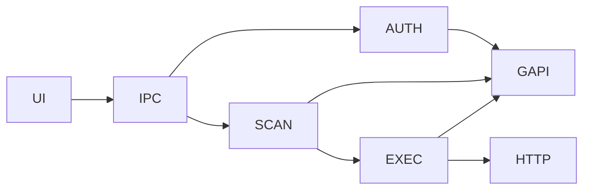

# Gmail Unsubscriber

<p align="center">
  
</p>

> Clean your inbox deterministically, locally, and at scale

---

## Project Overview

Inbox overload is exponential. This tool provides a **deterministic, privacy first unsubscribe workflow** without external data exposure.

---

## Features

- OAuth authentication  
- Incremental inbox scan  
- Header based subscription detection  
- Sender grouping  
- Batched unsubscribe execution  
- Local only processing  

---

## Architecture



---

## Setup

```bash
git clone https://github.com/Kaelith69/UnSub.git
cd UnSub
npm install
cp .env.example .env
npm run dev
```

---

## License

MIT