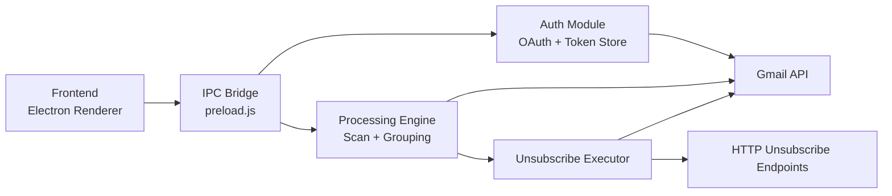
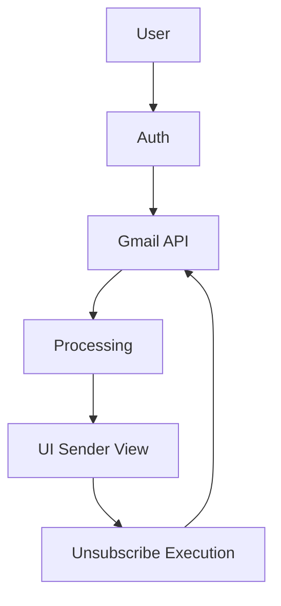

# Gmail Unsubscriber

<svg width="100%" viewBox="0 0 960 240" xmlns="http://www.w3.org/2000/svg" role="img" aria-label="Gmail Unsubscriber banner">
   <defs>
      <linearGradient id="bg" x1="0" y1="0" x2="1" y2="1">
         <stop offset="0%" stop-color="#0b1220" />
         <stop offset="100%" stop-color="#1c2942" />
      </linearGradient>
      <linearGradient id="accent" x1="0" y1="0" x2="1" y2="0">
         <stop offset="0%" stop-color="#34d399" />
         <stop offset="100%" stop-color="#60a5fa" />
      </linearGradient>
      <filter id="softGlow" x="-20%" y="-20%" width="140%" height="140%">
         <feGaussianBlur stdDeviation="3" result="blur"/>
         <feMerge>
            <feMergeNode in="blur"/>
            <feMergeNode in="SourceGraphic"/>
         </feMerge>
      </filter>
   </defs>

   <rect x="0" y="0" width="960" height="240" rx="18" fill="url(#bg)"/>
   <rect x="24" y="24" width="912" height="192" rx="14" fill="none" stroke="url(#accent)" stroke-opacity="0.45"/>

   <circle cx="120" cy="120" r="42" fill="#111827" stroke="#34d399" stroke-width="2" filter="url(#softGlow)">
      <animate attributeName="r" values="40;42;40" dur="3.2s" repeatCount="indefinite"/>
   </circle>
   <text x="120" y="128" text-anchor="middle" font-family="ui-monospace, SFMono-Regular, Menlo, monospace" font-size="28" fill="#e5e7eb">0xU</text>

   <text x="200" y="105" font-family="Inter, Segoe UI, system-ui, sans-serif" font-size="46" font-weight="700" fill="#f9fafb">Gmail Unsubscriber</text>
   <text x="200" y="145" font-family="Inter, Segoe UI, system-ui, sans-serif" font-size="22" fill="#cbd5e1">Clean your inbox like a machine</text>

   <rect x="200" y="166" width="340" height="6" rx="3" fill="url(#accent)">
      <animate attributeName="width" values="210;340;210" dur="2.8s" repeatCount="indefinite"/>
   </rect>
</svg>

## 1. Project Overview

Inbox chaos is real. This app gives you a deterministic unsubscribe workflow without sending your mail data to some random cloud backend.

Why this exists:

- Newsletters multiply faster than tabs in a weekend debug session
- Gmail UI is great, but not optimized for bulk unsubscribe triage
- You should be able to clean up at scale without sacrificing privacy
- Subscription cleanup should be transparent, reversible where possible, and fast

Key idea:

- Authenticate once with Google OAuth
- Scan inbox metadata safely and incrementally
- Group by sender and detect unsubscribe mechanisms
- Execute unsubscribe in controlled batches with progress and fallbacks

## 2. Features

- Gmail OAuth login: Secure browser-based OAuth flow with token lifecycle handling
- Inbox scanning: Incremental Gmail pagination with progress updates
- Subscription detection: List-Unsubscribe header + subject heuristics
- Sender grouping: Aggregates by sender for practical decision making
- Bulk unsubscribe: Batched unsubscribe execution with retries and status reporting
- Local processing: Runs on-device with no remote analytics backend

## 3. Demo Flow

1. Sign in with Google
2. Scan inbox (select scan depth)
3. Review grouped senders
4. Select safe or custom targets
5. Execute unsubscribe and optional inbox cleanup

## 4. System Architecture



## 5. Data Flow Diagram



## 6. Tech Stack

- Frontend: HTML, CSS, vanilla JavaScript (Electron renderer)
- Desktop runtime: Electron
- Main process: Node.js
- APIs: Gmail API via Google OAuth2
- Libraries:
   - googleapis
   - electron-store
   - cheerio
   - electron-builder

## 7. How It Works (Deep Dive)

### OAuth flow

1. Renderer calls auth IPC
2. Main process spins OAuth flow in browser
3. Callback exchanges code for tokens
4. Tokens stored locally (encrypted store)
5. Profile check validates session health

### Email fetching

- Uses Gmail pagination (messages list)
- Pulls only required fields for efficiency
- Processes incrementally to avoid full in-memory message loading

### Subscription detection logic

- Primary signal: List-Unsubscribe headers
- Secondary signal: subject/keyword heuristics
- Sender risk classification flags likely important senders

### Unsubscribe execution

Execution order is deliberate:

1. RFC 8058 one-click POST (best when available)
2. Header/body HTTP unsubscribe links
3. Mailto fallback (queued, delivery not guaranteed)

Plus:

- Retries with exponential backoff for transient failures
- Optional inbox cleanup (move matching messages to Trash)
- Detailed per-sender progress and outcome reporting

## 8. Performance Strategy

- Batching: controlled promise pools for scan and execution
- Lazy/incremental processing: page-streamed scan pipeline
- Concurrency control: adaptive limits by scan size
- UI virtualization: large sender lists render only visible rows
- O(1) lookups: sender map indexing and filtered result caching

## 9. Privacy + Security

- Local processing first: no third-party analytics pipeline
- Token handling: encrypted local persistence
- Secret hygiene: OAuth credentials via environment variables
- Network safety: unsubscribe URL validation with blocked private/local targets
- No plaintext credential commits (push protection compatible)

## 10. Setup Instructions

### Prerequisites

- Node.js 18+
- npm
- Google Cloud project with Gmail API enabled
- OAuth Desktop client credentials

### Installation

```bash
npm install
```

### Environment Variables

Create a local .env file (do not commit):

```bash
GOOGLE_CLIENT_ID=your_client_id_here
GOOGLE_CLIENT_SECRET=your_client_secret_here
```

### Run locally

```bash
npm run dev
```

### Build

```bash
npm run build:win
npm run build:linux
```

## 11. Roadmap

- AI prioritization for sender importance scoring
- Smart filters (frequency + intent + engagement)
- Lightweight analytics dashboard for cleanup sessions
- Better mailto outcome tracking and suppression policy tuning

## 12. Contributing

PRs are welcome. Keep changes focused and measurable.

Guidelines:

1. Open an issue with problem statement and expected behavior
2. Keep commits atomic and descriptive
3. Include validation notes (what changed, how it was tested)
4. Avoid introducing hardcoded secrets or local-only assumptions

## 13. License

No license file is currently present in this repository.

Until a license is added, treat usage as all-rights-reserved by default.
