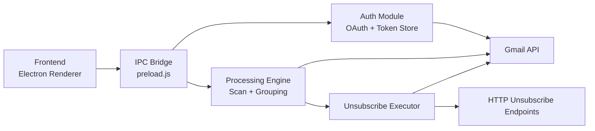
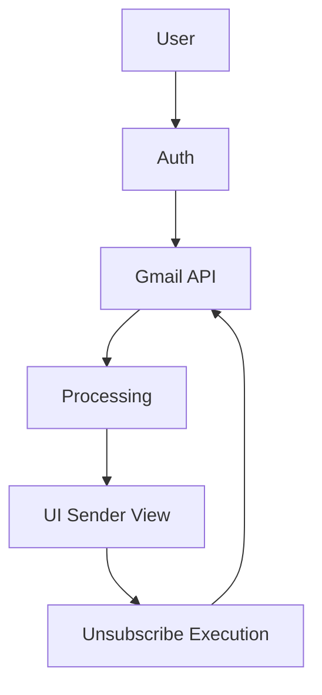

# Gmail Unsubscriber

<svg width="100%" height="280" viewBox="0 0 1000 280" xmlns="http://www.w3.org/2000/svg" role="img" aria-label="Gmail Unsubscriber - Clean your inbox like a machine">
  <defs>
    <!-- Primary gradient background -->
    <linearGradient id="bgGradient" x1="0%" y1="0%" x2="100%" y2="100%">
      <stop offset="0%" stop-color="#0f172a" stop-opacity="1"/>
      <stop offset="50%" stop-color="#1a1f35" stop-opacity="1"/>
      <stop offset="100%" stop-color="#0d1117" stop-opacity="1"/>
    </linearGradient>

    <!-- Accent gradient for highlights and borders -->
    <linearGradient id="accentGradient" x1="0%" y1="0%" x2="100%" y2="0%">
      <stop offset="0%" stop-color="#10b981"/>
      <stop offset="50%" stop-color="#06b6d4"/>
      <stop offset="100%" stop-color="#3b82f6"/>
    </linearGradient>

    <!-- Subtle shine effect -->
    <linearGradient id="shineGradient" x1="0%" y1="0%" x2="100%" y2="100%">
      <stop offset="0%" stop-color="#ffffff" stop-opacity="0.1"/>
      <stop offset="50%" stop-color="#ffffff" stop-opacity="0"/>
      <stop offset="100%" stop-color="#ffffff" stop-opacity="0.05"/>
    </linearGradient>

    <!-- Glow filter -->
    <filter id="glow">
      <feGaussianBlur stdDeviation="2" result="coloredBlur"/>
      <feMerge>
        <feMergeNode in="coloredBlur"/>
        <feMergeNode in="SourceGraphic"/>
      </feMerge>
    </filter>

    <!-- Soft shadow -->
    <filter id="shadow" x="-50%" y="-50%" width="200%" height="200%">
      <feDropShadow dx="0" dy="2" stdDeviation="3" flood-opacity="0.15"/>
    </filter>

    <!-- Icon pattern -->
    <pattern id="dotPattern" x="0" y="0" width="40" height="40" patternUnits="userSpaceOnUse">
      <circle cx="20" cy="20" r="0.5" fill="#3b82f6" opacity="0.1"/>
    </pattern>
  </defs>

  <!-- Background -->
  <rect width="1000" height="280" fill="url(#bgGradient)"/>

  <!-- Dot pattern overlay -->
  <rect width="1000" height="280" fill="url(#dotPattern)"/>

  <!-- Border glow effect -->
  <rect x="20" y="20" width="960" height="240" rx="16" fill="none" stroke="url(#accentGradient)" stroke-width="2" opacity="0.3" filter="url(#glow)"/>

  <!-- Main card container -->
  <rect x="24" y="24" width="952" height="232" rx="14" fill="url(#bgGradient)" stroke="url(#accentGradient)" stroke-width="1.5" opacity="0.8" filter="url(#shadow)"/>

  <!-- Shine overlay -->
  <rect x="24" y="24" width="952" height="116" rx="14" fill="url(#shineGradient)"/>

  <!-- Left decorative icon area -->
  <g>
    <!-- Animated pulse circle -->
    <circle cx="100" cy="140" r="45" fill="none" stroke="#10b981" stroke-width="1.5" opacity="0.3">
      <animate attributeName="r" values="45;55;45" dur="3s" repeatCount="indefinite" timing-function="ease-in-out"/>
      <animate attributeName="opacity" values="0.3;0.1;0.3" dur="3s" repeatCount="indefinite"/>
    </circle>

    <!-- Main icon circle -->
    <circle cx="100" cy="140" r="38" fill="#1a1f35" stroke="url(#accentGradient)" stroke-width="2" filter="url(#glow)"/>

    <!-- Inner animated rotation ring -->
    <circle cx="100" cy="140" r="32" fill="none" stroke="url(#accentGradient)" stroke-width="1" opacity="0.5">
      <animateTransform attributeName="transform" type="rotate" values="0 100 140; 360 100 140" dur="8s" repeatCount="indefinite"/>
    </circle>

    <!-- Icon text -->
    <text x="100" y="150" text-anchor="middle" font-family="'Courier New', monospace" font-size="32" font-weight="bold" fill="#10b981" letter-spacing="2">0xU</text>
  </g>

  <!-- Main content area -->
  <g>
    <!-- Main heading -->
    <text x="200" y="100" font-family="'Segoe UI', 'Helvetica Neue', sans-serif" font-size="48" font-weight="700" fill="#ffffff" letter-spacing="-0.5">
      Gmail Unsubscriber
    </text>

    <!-- Subheading with gradient text effect -->
    <defs>
      <linearGradient id="textGradient" x1="0%" y1="0%" x2="100%" y2="0%">
        <stop offset="0%" stop-color="#10b981"/>
        <stop offset="100%" stop-color="#3b82f6"/>
      </linearGradient>
    </defs>
    <text x="200" y="145" font-family="'Segoe UI', 'Helvetica Neue', sans-serif" font-size="20" font-weight="500" fill="url(#textGradient)">
      Clean your inbox like a machine
    </text>

    <!-- Decorative line with animation -->
    <rect x="200" y="165" width="0" height="3" rx="1.5" fill="url(#accentGradient)">
      <animate attributeName="width" values="0;260;260;0" dur="4s" repeatCount="indefinite" timing-function="ease-in-out"/>
    </rect>

    <!-- Feature tags -->
    <g>
      <!-- Tag 1 -->
      <rect x="200" y="200" width="90" height="24" rx="12" fill="#10b981" opacity="0.15" stroke="#10b981" stroke-width="1"/>
      <text x="245" y="216" text-anchor="middle" font-family="'Segoe UI', sans-serif" font-size="11" font-weight="600" fill="#10b981">OAuth Enabled</text>

      <!-- Tag 2 -->
      <rect x="310" y="200" width="85" height="24" rx="12" fill="#06b6d4" opacity="0.15" stroke="#06b6d4" stroke-width="1"/>
      <text x="352" y="216" text-anchor="middle" font-family="'Segoe UI', sans-serif" font-size="11" font-weight="600" fill="#06b6d4">Privacy First</text>

      <!-- Tag 3 -->
      <rect x="415" y="200" width="115" height="24" rx="12" fill="#3b82f6" opacity="0.15" stroke="#3b82f6" stroke-width="1"/>
      <text x="472" y="216" text-anchor="middle" font-family="'Segoe UI', sans-serif" font-size="11" font-weight="600" fill="#3b82f6">Bulk Unsubscribe</text>
    </g>
  </g>

  <!-- Right side accent elements -->
  <g opacity="0.6">
    <!-- Floating accent dots -->
    <circle cx="850" cy="60" r="3" fill="#10b981" filter="url(#glow)">
      <animate attributeName="cy" values="60;70;60" dur="3s" repeatCount="indefinite"/>
    </circle>
    <circle cx="900" cy="80" r="2.5" fill="#06b6d4" filter="url(#glow)">
      <animate attributeName="cy" values="80;90;80" dur="3.5s" repeatCount="indefinite"/>
    </circle>
    <circle cx="850" cy="200" r="2" fill="#3b82f6" filter="url(#glow)">
      <animate attributeName="cy" values="200;210;200" dur="4s" repeatCount="indefinite"/>
    </circle>
  </g>
</svg>

## 1. Project Overview

Inbox chaos is real. This app gives you a deterministic unsubscribe workflow without sending your mail data to some random cloud backend.

### 🚀 Quick Start

```bash
# 1. Clone & install
git clone https://github.com/Kaelith69/UnSub.git && cd UnSub && npm install

# 2. Get OAuth credentials (Google Cloud Console)
# See "Step 1: Google OAuth Setup" below

# 3. Create .env from template
cp .env.example .env
# Edit .env and add your client ID & secret

# 4. Run locally
npm run dev
```

**Full setup instructions below** ⬇️

---

## 2. Why It Exists

- Newsletters multiply faster than tabs in a weekend debug session
- Gmail UI is great, but not optimized for bulk unsubscribe triage
- You should be able to clean up at scale without sacrificing privacy
- Subscription cleanup should be transparent, reversible where possible, and fast

## 3. Key Idea

- Authenticate once with Google OAuth
- Scan inbox metadata safely and incrementally
- Group by sender and detect unsubscribe mechanisms
- Execute unsubscribe in controlled batches with progress and fallbacks

## 4. Features

- Gmail OAuth login: Secure browser-based OAuth flow with token lifecycle handling
- Inbox scanning: Incremental Gmail pagination with progress updates
- Subscription detection: List-Unsubscribe header + subject heuristics
- Sender grouping: Aggregates by sender for practical decision making
- Bulk unsubscribe: Batched unsubscribe execution with retries and status reporting
- Local processing: Runs on-device with no remote analytics backend

## 5. Demo Flow

1. Sign in with Google
2. Scan inbox (select scan depth)
3. Review grouped senders
4. Select safe or custom targets
5. Execute unsubscribe and optional inbox cleanup

## 6. System Architecture



## 7. Data Flow Diagram



## 8. Tech Stack

- Frontend: HTML, CSS, vanilla JavaScript (Electron renderer)
- Desktop runtime: Electron
- Main process: Node.js
- APIs: Gmail API via Google OAuth2
- Libraries:
  - googleapis
  - electron-store
  - cheerio
  - electron-builder

## 9. How It Works (Deep Dive)

### OAuth flow

1. Renderer calls auth IPC
2. Main process spins OAuth flow in browser
3. Callback exchanges code for tokens
4. Tokens stored locally (encrypted store)
5. Profile check validates session health

### Email fetching

- Uses Gmail pagination (messages list)
- Pulls only required fields for efficiency
- Processes incrementally to avoid full in-memory message loading

### Subscription detection logic

- Primary signal: List-Unsubscribe headers
- Secondary signal: subject/keyword heuristics
- Sender risk classification flags likely important senders

### Unsubscribe execution

Execution order is deliberate:

1. RFC 8058 one-click POST (best when available)
2. Header/body HTTP unsubscribe links
3. Mailto fallback (queued, delivery not guaranteed)

Plus:

- Retries with exponential backoff for transient failures
- Optional inbox cleanup (move matching messages to Trash)
- Detailed per-sender progress and outcome reporting

## 10. Performance Strategy

- Batching: controlled promise pools for scan and execution
- Lazy/incremental processing: page-streamed scan pipeline
- Concurrency control: adaptive limits by scan size
- UI virtualization: large sender lists render only visible rows
- O(1) lookups: sender map indexing and filtered result caching

## 11. Privacy + Security

- **Local processing first:** No third-party analytics pipeline
- **Token handling:** Encrypted local persistence via `electron-store`
- **Secret hygiene:** OAuth credentials stored in `.env` file (git-ignored, never committed)
- **Network safety:** Unsubscribe URL validation blocks private/local IP targets
- **Environment-based config:** All sensitive values from env vars, not hardcoded
- **No plaintext commits:** Compatible with GitHub push protection

### Best Practices

1. Never share or commit `.env` file

```bash
# This should be in .gitignore (it is):
cat .gitignore
# Should show: .env
```

1. Use `.env.example` as a template for other developers

```bash
cp .env.example .env
# Then fill in your credentials
```

1. Rotate OAuth secrets periodically
   - Generate new credentials in Google Cloud Console
   - Update `.env` locally
   - Rebuild and redistribute

## 12. Setup Instructions

### Prerequisites

- Node.js 18+
- npm
- Google Cloud account (free tier available)

### Step 1: Google OAuth Setup (One-Time)

1. Go to [Google Cloud Console](https://console.cloud.google.com)
2. Click **Create Project**
   - Project name: "Gmail Unsubscriber" (or your choice)
3. Select your project → **Enable APIs and Services**
4. Search for **Gmail API** → Click **Enable**
5. Go to **Credentials** in the left sidebar
   - Click **+ Create Credentials** → OAuth client ID
   - Choose **Desktop application**
   - Download the JSON file
   - Copy `client_id` and `client_secret` values
6. Configure OAuth consent screen:
   - Go to **OAuth consent screen**
   - Choose **External** user type
   - Add required Scopes:
     - `gmail.readonly`
     - `gmail.modify`
     - `userinfo.email`
   - Add test users if keeping in development mode

### Step 2: Clone & Install

```bash
git clone https://github.com/Kaelith69/UnSub.git
cd UnSub
npm install
```

### Step 3: Configure Environment Variables

```bash
# Copy the example file
cp .env.example .env

# Edit .env and add your OAuth credentials
# GOOGLE_CLIENT_ID=your_client_id_from_step_1
# GOOGLE_CLIENT_SECRET=your_client_secret_from_step_1
```

**Important:** `.env` is in `.gitignore` and will never be committed.

### Step 4: Run Locally

```bash
npm run dev
```

The app will launch. Authenticate with your Google account on first run.

### Step 5: Build for Distribution

```bash
# Windows installer
npm run build:win

# Linux AppImage + deb
npm run build:linux

# Both
npm run build:all
```

Build outputs are in the `dist/` directory.

Build outputs are in the `dist/` directory.

| Output | Platform |
| --- | --- |
| `.exe` + installer | Windows |
| `.AppImage` | Linux (portable) |
| `.deb` | Linux (system package) |

## 13. Troubleshooting

### "OAuth client not configured" at startup

**Issue:** App shows "OAuth not configured"

**Fix:** Verify `.env` file exists in workspace root with valid credentials:

```bash
# Check file exists
ls -la .env  # or `dir .env` on Windows

# Verify content
cat .env
# Should show:
# GOOGLE_CLIENT_ID=abc123...
# GOOGLE_CLIENT_SECRET=xyz789...
```

### "Failed to fetch messages" / 403 Forbidden errors

**Issue:** Scan fails with permission errors

**Potential causes:**

1. OAuth consent screen not published (only test users can auth in dev mode)
   - **Fix:** Publish your OAuth app in Google Cloud Console
2. Gmail API not enabled
   - **Fix:** Verify in Google Cloud Console → APIs → Gmail API is enabled

### Unsubscribe "Mailto" emails return as read

**Issue:** Some unsubscribes open email draft that auto-marks as read

**Expected behavior:** Mailto unsubscribes are fallback only—try HTTP links first

**Mitigation:** Enable "optional cleanup" to move matching messages to Trash

### App crashes on large inbox scan

**Issue:** Scan fails or freezes on very large inboxes (100k+ messages)

**Diagnosis:**

```bash
# Run with performance logging enabled
npm run dev -- --dev
# Watch console for timing metrics
```

**Fix:** Reduce scan depth (select "Last 3 months" or "Last 1 month" from UI dropdown)

- AI prioritization for sender importance scoring
- Smart filters (frequency + intent + engagement)
- Lightweight analytics dashboard for cleanup sessions
- Better mailto outcome tracking and suppression policy tuning

## 14. Contributing

PRs are welcome. Keep changes focused and measurable.

Guidelines:

1. Open an issue with problem statement and expected behavior
2. Keep commits atomic and descriptive
3. Include validation notes (what changed, how it was tested)
4. Avoid introducing hardcoded secrets or local-only assumptions
5. Use environment variables for all configuration

## 15. License

This project is currently licensed under the **MIT License**.

See [LICENSE](./LICENSE) for details, or:

```text
MIT License - Free to use, modify, and distribute
Requires: Include copyright notice and license text
```

### Quick Summary

✅ You can use this for personal, commercial, or educational purposes  
✅ You can modify and redistribute  
✅ Include the license notice when distributing  
❌ No warranty provided
