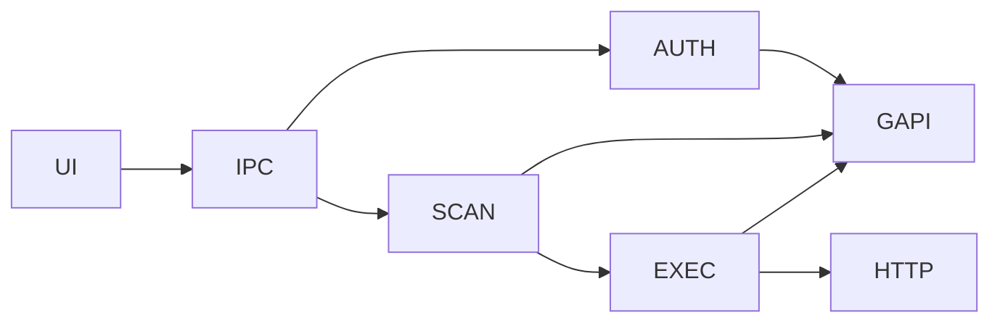

# Gmail Unsubscriber

<div align="center">
  
</div>

> Clean your inbox deterministically, locally, and at scale.

---

## Project Overview

Inbox overload is exponential. This tool provides a **deterministic, privacy-first unsubscribe workflow** without external data exposure.

---

## Features

- OAuth 2.0 authentication
- Incremental inbox scan
- Header-based subscription detection
- Sender grouping
- Batched unsubscribe execution
- Local-only processing

---

## Architecture



---

## Setup

### Prerequisites
- Node.js 18+
- Google account with Gmail access
- Google Cloud project with OAuth 2.0 credentials

### Step 1: Create OAuth Credentials

1. Go to [Google Cloud Console](https://console.cloud.google.com)
2. Create a new project or select an existing one
3. Enable the Gmail API:
   - Click "Enable APIs and Services"
   - Search for "Gmail API" and click "Enable"
4. Set up OAuth consent screen:
   - Go to "APIs & Services" > "OAuth consent screen"
   - Choose "External" user type
   - Fill in required information (app name, user support email, etc.)
   - Add scopes: `gmail.readonly`, `gmail.modify`, `userinfo.email`
5. Create OAuth credentials:
   - Go to "APIs & Services" > "Credentials"
   - Click "Create Credentials" > "OAuth client ID"
   - Choose "Desktop application"
   - Copy the Client ID and Client Secret

### Step 2: Install and Run

```bash
git clone https://github.com/Kaelith69/UnSub.git
cd UnSub/gmail-unsub-electron
npm install
cp .env.example .env
# Edit .env and fill in your GOOGLE_CLIENT_ID and GOOGLE_CLIENT_SECRET
npm run dev
```

### Step 3: Build (Optional)

```bash
npm run build:win     # Windows
npm run build:linux   # Linux
npm run build:all     # Both platforms
```

---

## Troubleshooting

### "OAuth credentials not configured"
- Make sure you have set `GOOGLE_CLIENT_ID` and `GOOGLE_CLIENT_SECRET` in your `.env` file
- Restart the app after updating `.env`

### "Sign-in failed"
- Verify your OAuth credentials are correct
- Make sure the redirect URI in Google Cloud Console is set to `http://localhost:9876/oauth2callback`
- Check that the Gmail API is enabled in your Google Cloud project

### "Scan failed" or "Not authenticated"
- Your session may have expired. Try signing out and signing in again
- Check your internet connection
- Verify your Gmail account has the necessary permissions

---

## License

[MIT](../LICENSE)